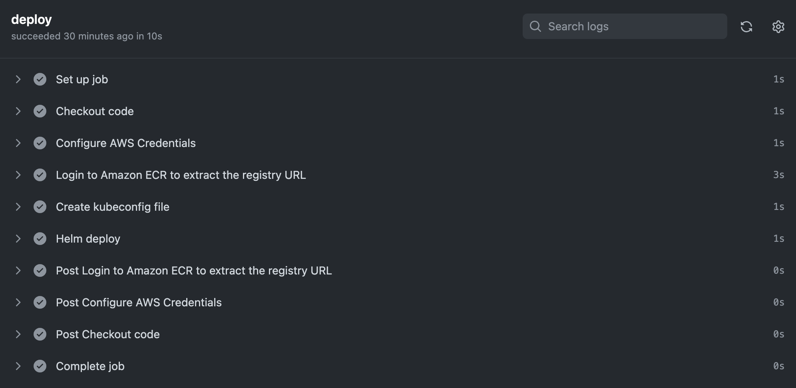

# Prerequisites
+ Create an ECR repo with AWS CLI:
```
aws ecr create-repository --repository-name devops-nginx --region ap-northeast-1
```

+ Replace the variable `ACCOUNT_ID` with your AWS account ID.
  - Apply a policy to the repo `devops-nginx`:
```
aws ecr set-repository-policy \
        --repository-name devops-nginx \
        --policy-text file://devops-nginx-ecr-policy.json \
        --region ap-northeast-1
```


+ Add the below repository secrets:
  1. In your repository navigation to Settings > Secrets and variables > Actions
  1. Under "Actions secrets and variables" select `New repository secret`

These secrets AWS_ACCESS_KEY_ID and AWS_SECRET_ACCESS_KEY should contain 
an IAM user that has rights to access the ECR and the EKS cluster.


## Create a helm chart from scratch
Create a local helm chart directory:
```
mkdir helm
helm create helm/devops-nginx
```

Under the helm chart directory to update template files to be appropriate configurations.

Helm chart structure:
```
devops-nginx/
├── Chart.yaml
├── charts
├── templates
│   ├── NOTES.txt
│   ├── _helpers.tpl
│   ├── deployment.yaml
│   ├── hpa.yaml
│   ├── ingress.yaml
│   ├── service.yaml
│   ├── serviceaccount.yaml
│   └── tests
│       └── test-connection.yaml
└── values.yaml
```

## Test the Github Actions workflows by committing
Whenever you push changes to Github, the workflow would run as it has the event below that triggers the workflow.
```
push:
  branches: [ main ]
```

Making a commitment to the repository, and we need to push to Github to trigger the workflow:
```
git add .
git commit -m "test workflow"
git push
```




## Query the EKS cluster
Execute these commands to check the status of relevant pods:
```
kubectl get po -n github-actions
helm ls -n github-actions
```


